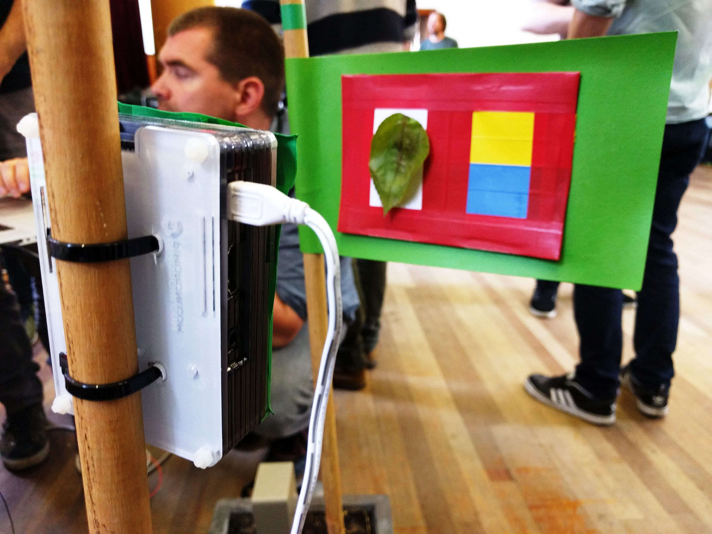
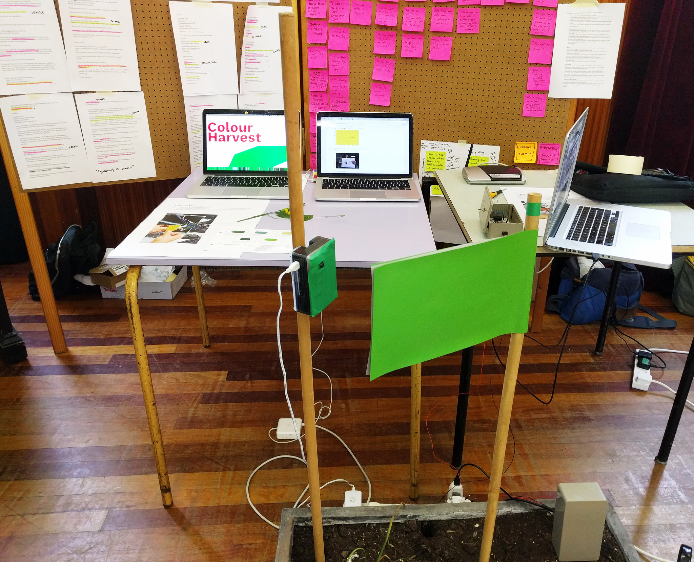
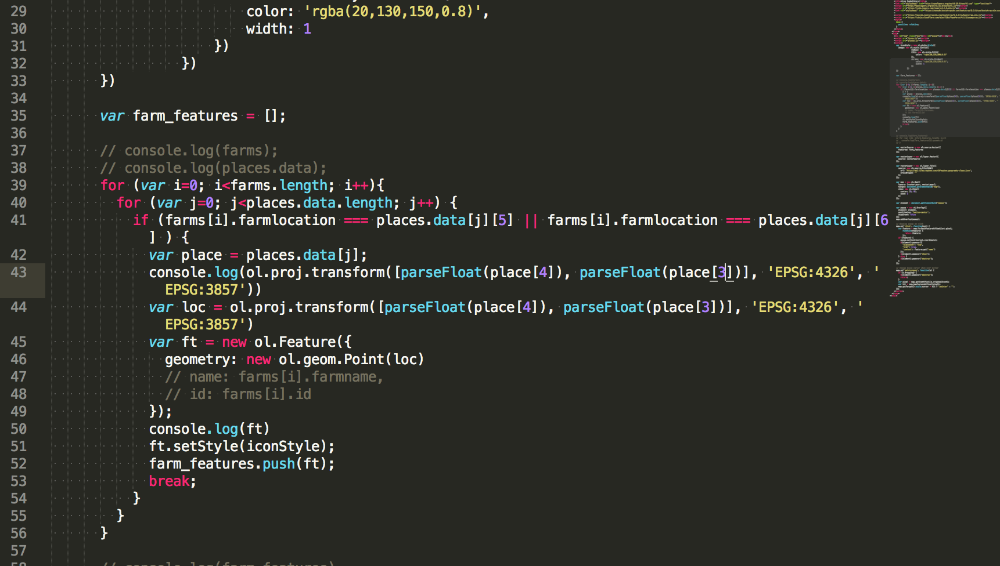

# Colour Harvest

### Our project is to understand the level of nitrates in crops by measuring the shade of green. We’re working on setting up a live data stream and making it robust to changing light levels.

*By Marcel Schouwenaar and Rachel Prudden at the Mozilla Open IoT Design Sprint in Anstruther, June 2016*

